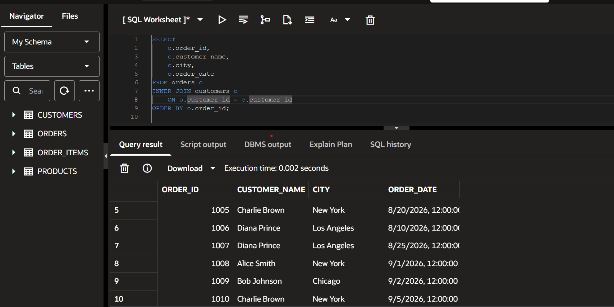
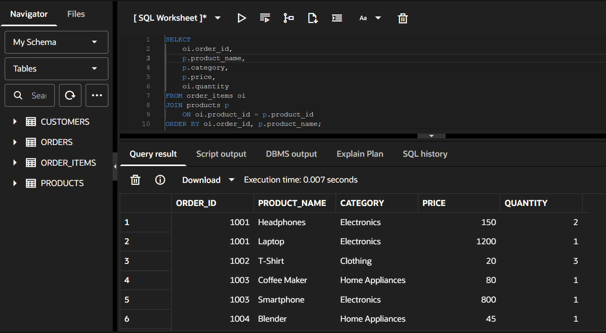
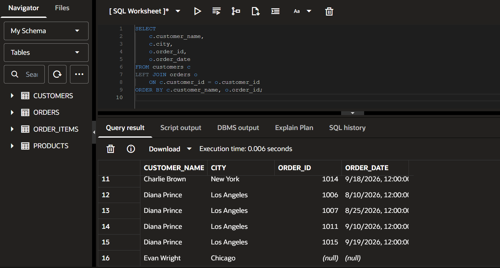
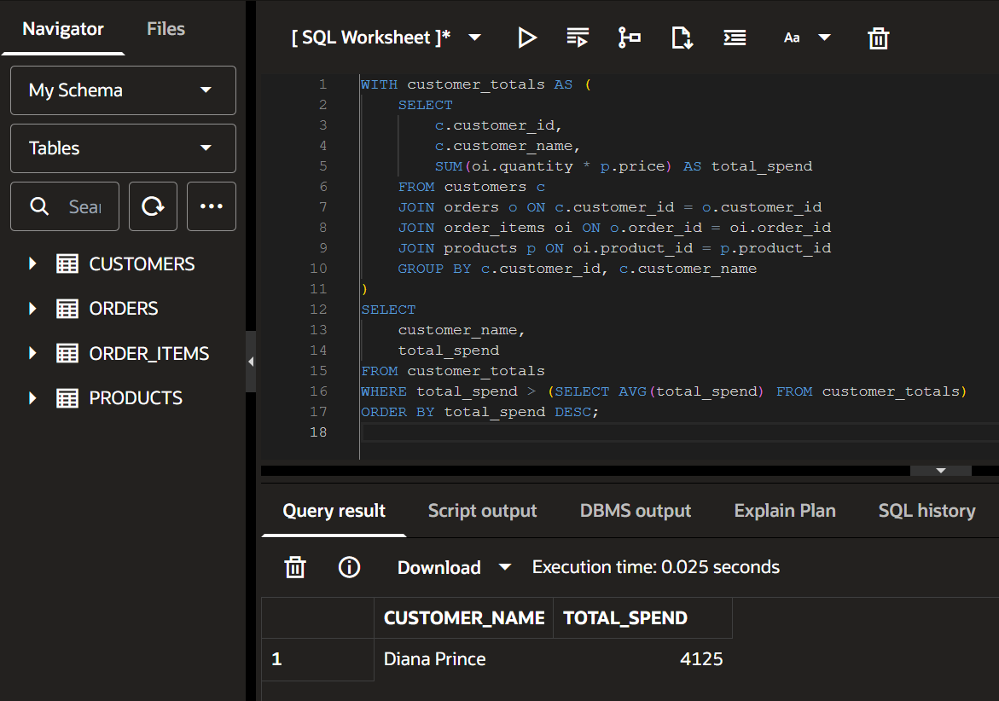
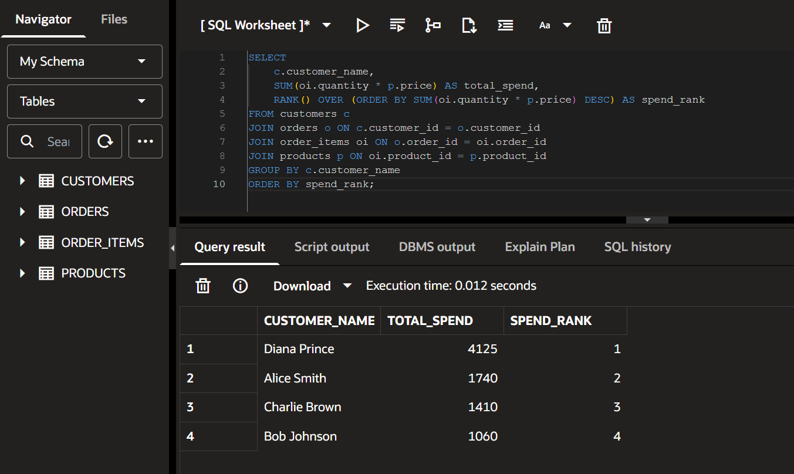
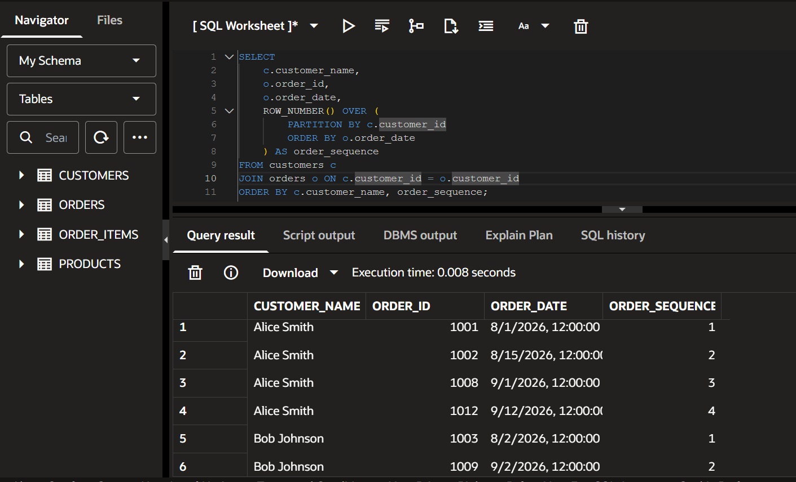
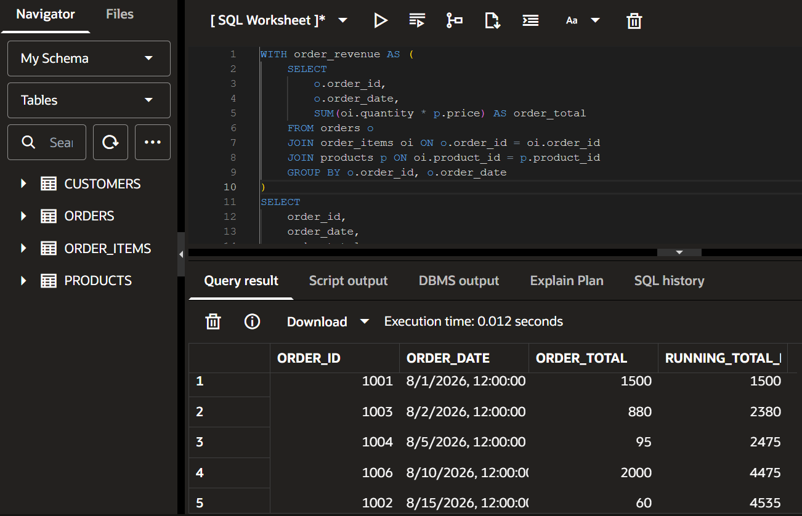
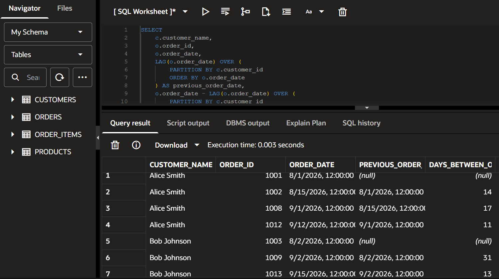

# PLSQL Assignment One - Sunrise Supermarket

## Student Information
- **Name:** Ingabire Kevin
- **Student ID:** 27780

## Summary of Work
For this assignment, I designed and populated a relational database for "Sunrise Supermarket" using Oracle SQL (specifically Oracle Live SQL). I created four tables (`customers`, `products`, `orders`, `order_items`) and populated them with data meeting the minimum requirements (5 customers, 8 products, 15 orders, 25 order items). I then wrote and executed a series of analytical queries using INNER JOINs, LEFT JOINs, Common Table Expressions (CTEs), and Window Functions to answer specific business questions.

## How to Run
To run this project, simply copy the SQL scripts in the order provided below into any Oracle SQL environment (like Oracle Live SQL or SQL Developer).

1. **Schema Creation:** Copy the `CREATE TABLE` statements provided below.
2. **Data Population:** Copy the `INSERT` statements provided in the "Data Insertion" section below.
3. **Analysis Queries:** Run each of the numbered queries below to see the results.

## Business Scenario
Sunrise Supermarket sells products to customers, who place orders containing one or more items. Management wants to understand who their customers are, what they buy, and how sales are trending over time.

---

## Schema Creation

```sql
CREATE TABLE customers (
    customer_id NUMBER PRIMARY KEY,
    customer_name VARCHAR2(100),
    email VARCHAR2(100),
    city VARCHAR2(50)
);

CREATE TABLE products (
    product_id NUMBER PRIMARY KEY,
    product_name VARCHAR2(100),
    category VARCHAR2(50),
    price NUMBER(10,2)
);

CREATE TABLE orders (
    order_id NUMBER PRIMARY KEY,
    customer_id NUMBER REFERENCES customers(customer_id),
    order_date DATE
);

CREATE TABLE order_items (
    order_item_id NUMBER PRIMARY KEY,
    order_id NUMBER REFERENCES orders(order_id),
    product_id NUMBER REFERENCES products(product_id),
    quantity NUMBER
);
-- Insert Customers (Note: Customer 5 has no orders to test LEFT JOIN later)
INSERT INTO customers VALUES (1, 'Alice Smith', 'alice@email.com', 'New York');
INSERT INTO customers VALUES (2, 'Bob Johnson', 'bob@email.com', 'Chicago');
INSERT INTO customers VALUES (3, 'Charlie Brown', 'charlie@email.com', 'New York');
INSERT INTO customers VALUES (4, 'Diana Prince', 'diana@email.com', 'Los Angeles');
INSERT INTO customers VALUES (5, 'Evan Wright', 'evan@email.com', 'Chicago');

-- Insert Products (8 products across 3 categories)
INSERT INTO products VALUES (101, 'Laptop', 'Electronics', 1200.00);
INSERT INTO products VALUES (102, 'Smartphone', 'Electronics', 800.00);
INSERT INTO products VALUES (103, 'Headphones', 'Electronics', 150.00);
INSERT INTO products VALUES (104, 'Coffee Maker', 'Home Appliances', 80.00);
INSERT INTO products VALUES (105, 'Blender', 'Home Appliances', 45.00);
INSERT INTO products VALUES (106, 'Desk Lamp', 'Home Appliances', 25.00);
INSERT INTO products VALUES (107, 'T-Shirt', 'Clothing', 20.00);
INSERT INTO products VALUES (108, 'Jeans', 'Clothing', 50.00);

-- Insert Orders (15 orders across different dates for the same customers)
INSERT INTO orders VALUES (1001, 1, TO_DATE('2026-08-01', 'YYYY-MM-DD'));
INSERT INTO orders VALUES (1002, 1, TO_DATE('2026-08-15', 'YYYY-MM-DD'));
INSERT INTO orders VALUES (1003, 2, TO_DATE('2026-08-02', 'YYYY-MM-DD'));
INSERT INTO orders VALUES (1004, 3, TO_DATE('2026-08-05', 'YYYY-MM-DD'));
INSERT INTO orders VALUES (1005, 3, TO_DATE('2026-08-20', 'YYYY-MM-DD'));
INSERT INTO orders VALUES (1006, 4, TO_DATE('2026-08-10', 'YYYY-MM-DD'));
INSERT INTO orders VALUES (1007, 4, TO_DATE('2026-08-25', 'YYYY-MM-DD'));
INSERT INTO orders VALUES (1008, 1, TO_DATE('2026-09-01', 'YYYY-MM-DD'));
INSERT INTO orders VALUES (1009, 2, TO_DATE('2026-09-02', 'YYYY-MM-DD'));
INSERT INTO orders VALUES (1010, 3, TO_DATE('2026-09-05', 'YYYY-MM-DD'));
INSERT INTO orders VALUES (1011, 4, TO_DATE('2026-09-10', 'YYYY-MM-DD'));
INSERT INTO orders VALUES (1012, 1, TO_DATE('2026-09-12', 'YYYY-MM-DD'));
INSERT INTO orders VALUES (1013, 2, TO_DATE('2026-09-15', 'YYYY-MM-DD'));
INSERT INTO orders VALUES (1014, 3, TO_DATE('2026-09-18', 'YYYY-MM-DD'));
INSERT INTO orders VALUES (1015, 4, TO_DATE('2026-09-19', 'YYYY-MM-DD'));

-- Insert Order Items (25 items in total)
INSERT INTO order_items VALUES (1, 1001, 101, 1);
INSERT INTO order_items VALUES (2, 1001, 103, 2);
INSERT INTO order_items VALUES (3, 1002, 107, 3);
INSERT INTO order_items VALUES (4, 1003, 102, 1);
INSERT INTO order_items VALUES (5, 1003, 104, 1);
INSERT INTO order_items VALUES (6, 1004, 105, 1);
INSERT INTO order_items VALUES (7, 1004, 106, 2);
INSERT INTO order_items VALUES (8, 1005, 108, 1);
INSERT INTO order_items VALUES (9, 1005, 107, 1);
INSERT INTO order_items VALUES (10, 1006, 101, 1);
INSERT INTO order_items VALUES (11, 1006, 102, 1);
INSERT INTO order_items VALUES (12, 1007, 103, 1);
INSERT INTO order_items VALUES (13, 1007, 104, 1);
INSERT INTO order_items VALUES (14, 1007, 105, 1);
INSERT INTO order_items VALUES (15, 1008, 106, 4);
INSERT INTO order_items VALUES (16, 1009, 107, 2);
INSERT INTO order_items VALUES (17, 1009, 108, 1);
INSERT INTO order_items VALUES (18, 1010, 101, 1);
INSERT INTO order_items VALUES (19, 1011, 102, 2);
INSERT INTO order_items VALUES (20, 1011, 103, 1);
INSERT INTO order_items VALUES (21, 1012, 104, 1);
INSERT INTO order_items VALUES (22, 1013, 105, 2);
INSERT INTO order_items VALUES (23, 1014, 106, 1);
INSERT INTO order_items VALUES (24, 1014, 107, 1);
INSERT INTO order_items VALUES (25, 1015, 108, 2);
```
---

## Query Results & Interpretations

### 1. JOIN Queries

#### Query 1.1: List every order with the customer's name, city, and order date (INNER JOIN)
**Business Interpretation:** This query provides a flat view of all orders, showing which customer placed them and when. It confirms that we have 15 active orders across 4 different customers. (Customer Evan Wright, who has no orders, is correctly excluded).


#### Query 1.2: List every order item with product name, category, price, and quantity (JOIN)
**Business Interpretation:** This query flattens the transaction data so we can see exactly what products were sold in each order. It helps management understand product demand (e.g., T-Shirts are popular, and Electronics are high value).


#### Query 1.3: List all customers and their orders where they exist (LEFT JOIN)
**Business Interpretation:** This is a crucial CRM (Customer Relationship Management) query. It lists every registered customer, even those who haven't bought anything. In our data, Evan Wright (Chicago) appears with NULL order details, allowing management to identify him as a target for marketing campaigns to encourage his first purchase.


---

### 2. CTE Query

#### Query 2.1: Customers above average spend (using CTE)
**Business Interpretation:** This query calculates the total spend of each customer and compares it to the overall average. It identifies our "VIP" customers. In our data, **Diana Prince** is the only customer who spent above the average (4,125), making her a top priority for loyalty rewards or targeted promotions.


---

### 3. Window Function Queries

#### Query 3.1: Rank customers by total amount spent
**Business Interpretation:** This ranks our customers from highest to lowest spending. It provides a clear leaderboard: 1st (Diana), 2nd (Alice), 3rd (Charlie), 4th (Bob). This helps management allocate marketing budgets efficiently.


#### Query 3.2: Number each customer's orders
**Business Interpretation:** This assigns a sequence number to each customer's orders (e.g., 1st order, 2nd order). This is useful for understanding customer loyalty and repeat purchase behavior.


#### Query 3.3: Running total of revenue over time
**Business Interpretation:** This query shows cumulative revenue growth over our 15 orders. It allows management to visualize sales trends over time, ending at a total company revenue of 8,335.


#### Query 3.4: Days between current and previous order
**Business Interpretation:** This query calculates the gap in days between consecutive orders for each customer. It helps identify buying frequency. For example, we can see Diana's purchasing intervals, which helps in predicting when she might order next.


---

## Challenges and Resolutions

**Challenge 1: Ensuring realistic data for Window Functions**
Initially, I needed to ensure that the `LAG()` function (for days between orders) and the `RANK()` function had enough valid data to return meaningful results. 

*Resolution:* I intentionally created multiple orders per customer spread across different dates. I also intentionally left one customer (Evan Wright) with zero orders, so that the `LEFT JOIN` query would have a definitive test case to prove it works correctly.

**Challenge 2: Calculating the Running Total**
Calculating a running total requires summing values from the current row and all previous rows. A standard `GROUP BY` would collapse all rows into one.

*Resolution:* I used a CTE first to get the total revenue per order, and then applied the `SUM() OVER (ORDER BY ...)` window function. This allowed me to keep each individual order visible while still calculating the accumulated total.

